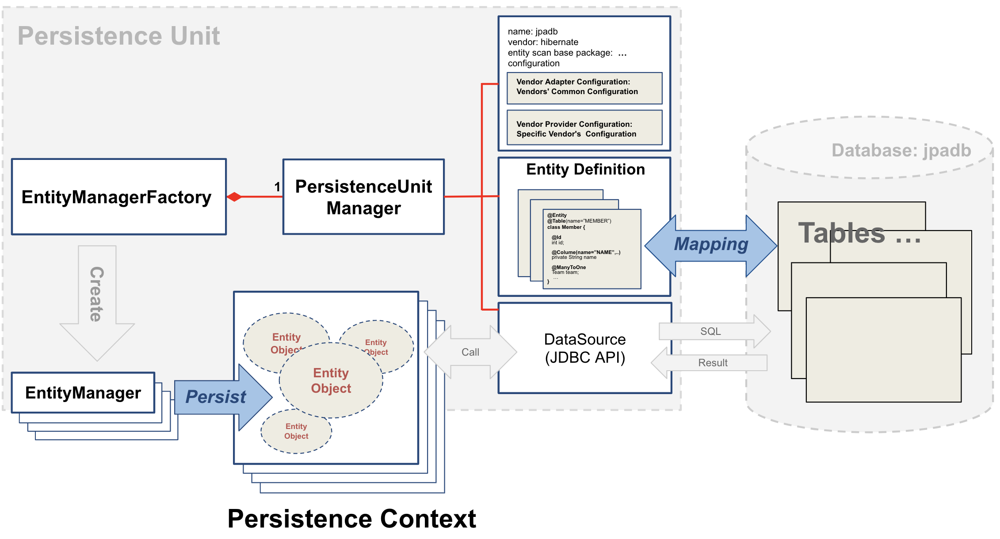

## Core Concepts

#### 1. Persistence Unit

#### 2. EntityManagerFactory & PersistenceUnitManager

#### 3. EntityManager & Persistence Context

#### 4. EntityTransaction, JpaTransactionManager and @Transactional

## JPA Programming

#### 1. Configuration of Persistence Unit

#### 2. Mapping

1. Entity Classes & Tables: @Entity & @Table
2. Primary Key: @Id ,,,
3. Field & Column: @Column ,,,
4. Association: @ManyToOne, @OneToMany, @ManyToMany ,,,

#### 3. Writing Repository

1. Persistence Repository
2. JPQL Reposotory
3. QueryDSL Repository
4. Spring Data JPA Repository
5. Spring Data JPA Repository + (JPQL, QueryDSL, Native SQL)

