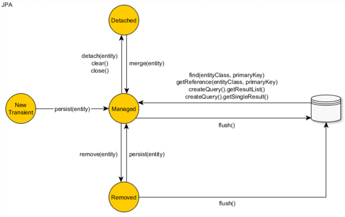
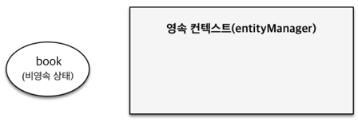
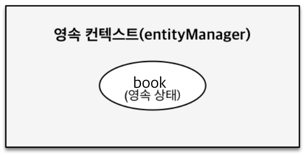

## 2. Entity의 생명 주기

#### 01. 비영속(new/transient)

1. 엔티티 객체를 생성한 상태로 em.persist() 호출 전 상태
2. 영속성 컨텍스트나 데이터베이스와 전혀 관계가 없는 상태

#### 02.영속(managed)

1. 엔티티 매니저를 통해 영속성 컨텍스트에 저장된 상태
2. 엔티티 가 영속성 컨텍스트에 의해 관리 되는 상태다.
3. em.find() 또는 JPQL을 사용해서 조회된 엔티티도 영속성 상태가 된다.

#### 03.준영속(detached)

1. 영속성 컨텍스트에 저장되었다가 분리된 상태
2. 영속성 컨텍스트가 관리하던 영속성 상태의 엔티티를 더이상 관리하지 않으면 준영속 상태가 된다.
3. em.detach() 호출하면서 영속성 상태의 엔티티를 넘겨주면 된다.
4. em.close()를 호출해서 영속성 컨텍스트를 닫으면 컨텍스트 안의 모든 엔티티는 준영속 상태가 된다.
5. em.clear()를 호출해 영속성 컨텍스트를 초기화 하면 컨텍스트 안의 모든 엔티티는 준영속 상태가 된다.

#### 04. 삭제(removed)

1. 삭제된 상태로 엔티티를 영속성 컨텍스트와 데이터베이스에서 삭제한다.

#### 05. 엔티티 조회, 등록, 수정 그리고 삭제