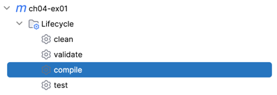
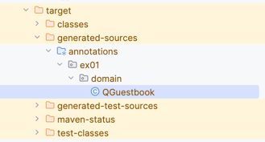

## 3. ex01.repository.QuerydslGuestbookRepository: QueryDSL 기반

#### 1. QueryDSL

1. JPQL을 사용하기 쉽게 기존의 Criteria 대용으로 사용하는 JPQL 래퍼 라이브러리
2. 문자열 기반이 아닌 코드로 JPQL을 작성할 수 있다.
3. QueryDSL이 지원하는 다양한 쿼리 메소드 사용법을 익혀야 한다.

#### 2. Dependency

```
<dependency>
    <groupId>com.querydsl</groupId>
    <artifactId>querydsl-jpa</artifactId>
</dependency>

<dependency>
    <groupId>com.querydsl</groupId>
    <artifactId>querydsl-apt</artifactId>
    <scope>provided</scope>
</dependency>

```

#### 3. QueryDSL Repository가 주입 받아야 하는 JPAQueryFactory Bean 설정

```java

@Bean
public JPAQueryFactory jpaQueryFactory(EntityManager entityManager) {
    return new JPAQueryFactory(entityManager);
}

```

#### 4. Repository 구현

1. QueryDSL를 편하게 쓰기 위해 JPAQueryFactory Bean을 주입 받는다.
2. 영속화 관리를 위해 EntityManager를 따로 주입 받지 않아도 된다. EntityManager가 필요한 경우에는 부모 클래스 QuerydslRepositorySupport의
   getEntityManager()를 사용한다.
3. 컴파일 오류: 쿼리 타입클래스 QGuestbook가 없기 때문에 발생!!

#### 5. QClass 생성하기

1. QueryDSL이 지원하는 쿼리 메소드를 사용하기 위해서는 엔티티 객체 그래프를 제공하는 쿼리 타입클래스라 부르는 QClass(Q로 시작), 쿼리용 클래스가 필요하다.
2. 엔티티 클래스를 기반으로 QClass를 생성해 주는 메이븐(또는 그래들) 플러그인을 설정해야 한다.
3. [참고] querydsl 5.x(Spring Boot 3.x, Jakarta Persistence) 부터는 플러그인 설정없이 QClass 생성이 가능하다.
4. [참고] querydsl plugin 설정 (pom.xml)

    ```xml
    
    <plugin>
        <groupId>com.mysema.maven</groupId>
        <artifactId>apt-maven-plugin</artifactId>
        <version>1.1.3</version>
        <executions>
            <execution>
                <goals>
                    <goal>process</goal>
                </goals>
                <configuration>
                    <outputDirectory>${basedir}/target/generated-sources/annotations</outputDirectory>
                    <processor>com.querydsl.apt.jpa.JPAAnnotationProcessor</processor>
                    <options>
                        <querydsl.entityAccessors>true</querydsl.entityAccessors>
                    </options>
                </configuration>
            </execution>
        </executions>
    </plugin>
    
    ```

5. compile goal 실행: mvn compile

   

   생성되었다!!!

   

#### Test 01: testSave

1. ex01.repository.QuerydslGuestbookRepository.save(guestbook)
2. 객체 영속화

#### Test 02: testFindAll

1. ex01.repository.QuerydslGuestbookRepository.findAll()
2. 쿼리 메소드 from(), orderBy(), fetch() 사용

#### Test 03: testFindAllWithProjection

1. ex01.repository.QuerydslGuestbookRepository.findAllWithProjection()
2. Projection을 위한 QueryDSL rojections.constructor(...) 사용법

#### Test 04: testDeleteByIdAndPassword

1. ex01.repository.QuerydslGuestbookRepository.deleteByIdAndPassword(id, password)
2. 쿼리 메소드 delete(), where(), eq(), end(), execute() 사용

