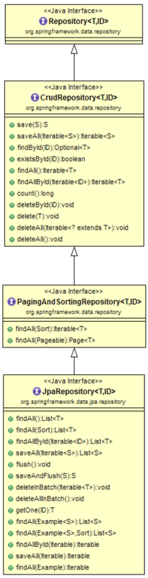

## 4. ex01.repository.JpaGuestbookRepository: Spring Data JPA

#### 1. 인터페이스 JpaRepository

1. Spring Data JPA에서 제공하는 인터페이스이다.
2. 상속받은 Repoitory Interface에 기본적인 CRUD 메서드를 제공한다.
3. 구현체는 애플리케이션 처음 시작 시, Spring Data JPA가 자동으로 생성해 DI 한다.
4. 데이터 접근 계층(DAO, Repository) 개발할 때 구현 클래스 없이 인터페이스만 작성해도 개발을 완료할 수 있다.
5. 인터페이스 JpaRepository의 상위(super) 인터페이스에 정의된 메소드들도 별다른 구현없이 모두 사용할 수 있다.(Hierachy 참고)

   

6. 더 막강한 기능은 쿼리 메소드(Query Method)다. 개발자가 정의한 메소드 이름만으로 내부에서 JPQL를 자동 생성해 준다.
7. NamedQuery 작성이 가능하다.
8. QueryDSL 또는 JPQL과 통합이 가능하다.
9. Specification를 사용해 다양한 여러 검색조건을 조립하여 검색을 할 수 있다.

#### 2. 설정

1. 설정 클래스에 @EnableJpaRepositories 어노테이션으로 JPA Repositories 활성화 한다.
2. 애플리케이션 실행 시, Spring Data JPA가 JpaRepository 인터페이스를 상속받은 Repository 인터페이스의 구현체(SimpleJpaRepository)를 자동으로 생성하게끔 한다.

   ```java
   
   @SpringBootApplication
   @EntityScan(basePackages = {"ex01.domain"})
   @EnableJpaRepositories(basePackages = {"ex01.repository"})
   public class Ch01Ex01Application {
   
       // ...(생략)
   
   } 
   ```

#### 3. 구현

1. 기본적으로 JpaRepository를 상속하는 Repository 인터페이스를 정의한다.

   ```java
   
   public interface JpaGuestbookRepository extends JpaRepository<Guestbook, Integer> {
   
   }
   
   ```

2. Repository 인터페이스 정의만으로 다음과 같은 주요 메소드들을 별다른 구현없이 바로 사용할 수 있다.
    1) CRUD 기능 : save(S), findOne(Id), exists(Id), count(), detete(T), deleteAll()
    2) 정열 및 페이징 : findAll(Sort), findAll(Pageable)

3. 뿐만아니라, 네이밍 규칙에 맞는 메소드들을 정의만 해주면 마찬가지로 별다른 구현없이 사용이 가능하다. 2개의 쿼리 메소드를 추가하였다.
    1) List<Guestbook> findAllByOrderByRegDateDesc()
    2) Integer deleteByIdAndPassword(Integer id, String password)

#### Test 01: testSave()

1. CrudRepository.save(S)

#### Test 02: testFindAll

1. JpaRepository.findAll()

#### Test 03: testFindAllWithSort

1. PagingAndSortingRepository.findAll(Sort)

#### Test 04: testFindAllWithPageRequest

1. PagingAndSortingRepository.findAll(Pageable)

#### Test 05: testFindAllOrderByRegDateDesc

1. JPA 쿼리 메소드 예시
2. ex01.repository.JpaGuestbookRepository.findAllByOrderByRegDateDesc()

#### Test 06: testDelete()

1. findById(id)
2. CrudRepository.delete(s)

#### Test 07: testDeleteById()

1. CrudRepository.deleteById(id)

#### Test 08: testDeleteByIdAndPassword

1. JPA 쿼리 메소드 예시
2. ex01.repository.JpaGuestbookRepository.deleteByNoAndPassword(id, password)