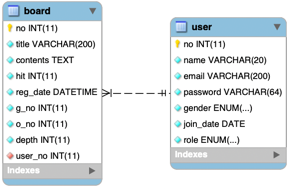
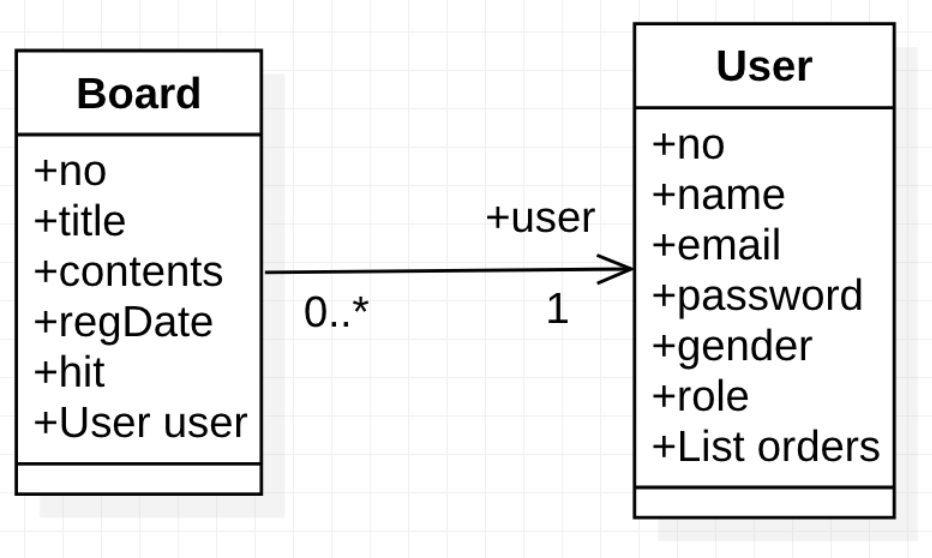

## 02. 다대일(ManyToOne) : 단방향(Unidirectional) : 게시판 [Board -> User]

#### 1. Domain

1. 테이블 연관관계 VS 객체 연관관계

   

   

2. 엔티티 연관관계 매핑의 3가지 기준
   1) 방향성(Direction): 객체지향의 Association에 가까운 개념
   2) 다중성(Multiplicity): 데이터베이스 Relation에 가까운 개념
   3) 연관관계의 주인(Owner of Associations)  
   
3. 서비스(비즈니스, 도메인)에서 방향성을 결정한다.
   1) 게시판의 경우, 게시판 리스트 화면에서 작성자를 표시해야 경우가 많다. (Board -> User, Navigational Association)  
   2) 반대로 특정 사용자의 글들을 가져와야 하는 경우는 경험상 흔치 않다
   3) 필요하다면, User->Board 관계도 잡으면 된다. 이 결정은 전적으로 서비스 도메인에 달려있다.  
   4) 이 모델에서는 단방향(Unidirection)으로 결정한다.  
   
4. 다중성은 방향성이 결정나면 쉽게 결정 할 수 있다.
   1) ManyToOne, OneToMany 또는 OneToOne를 결정하는 것은 쉽다.
   2) 참조를 해야만 하는 엔티티 기준으로 결정하면 된다.
   3) 참조를 해야만 하는 엔티티(연관관계의 주인)이 되는 엔티티를 왼쪽에 두고 생각한다.
   4) A -> B 인 경우, A 기준이다. 따라서, Board -> User에서는 Board가 기준이다.  
   5) 데이터 모델링 Relation에서, Board가 Many, User가 One 이므로 ManyToOne 이다.  

5. 단방향에서는 연관관계의 주인을 따지지 않아도 된다.
   1) 연관관계의 주인은 관계를 바꿀 수 있는 필드를 의미한다.
   2) 연관관계의 단방향 매핑에서는 연관관계 매핑을 하는 엔티티의 필드에만 하기 때문에 사실 관계주인 설정을 하지 않는다. 
   3) 주인이 없는 것이 아니라 당연히 이 필드가 주인이기 때문에 설정을 하지 않는다.


#### 2. Entity Class: Board, User
1. ex02.domain.User

   ```
   
   ...(생략)
   
   @ManyToOne
   @JoinColumn(name = "user_no")
   private User user;

   ...(생략)
   
   ```
   
   1) 관계의 주인이 되는 엔티티에 연관관계 매핑을 한다.
   2) 데이터베이스 테이블에서는 N:1 관계에서는 N쪽에 외래키를 둔다. 연과관계 매핑에서도 마찬가지다.
   3) @ManyToOne: 다중성 결정 어노테이션
   4) @JoinColumn: 외래키(조인칼럼)을 어노테이션과 함께 속성값으로 지정한다.

2. ex02.domain.Board
   1) 엔티티 매핑만 하면 된다.
   2) 당연히, 단방향에서는 관계의 주인이 아닌 엔티티는 연관관계 매핑을 하지 않는다. (관계 매핑필드 자체가 존재하지 않음)


#### 3. Tech. Focus
1. JPQL 기반 Repository 작성
2. QueryDSL 기반 Repository 작성
3. Spring Data JPA 기반 Repository 작성
4. ManyToOne(Unidirection)에서 left outer join, inner join, join fetch의 차이점과 성능이슈
5. 세 종류(JPQL, QueryDSL, Spring Data JPA)의 각각의 Repository 작성에서 프로젝션, 페이징, 소팅, Like 검색 등의 작성방법
6. Spring Data JPA Repository가 제공하는 기본 메소드들과 이름 기반의 쿼리메소드들이 생성하는 SQL들을 검증하고 QueryDSL과의 통합이 필수임을 재확인
7. 참조 Entity(User)를 fecth하는 전략 FetchType.EAGER 와 FetchType.LAZY 이해
 
 


#### 4. ex02.repository.JpqlBoardRepository: based on JPQL
1. save
   1) 저장(insert)을 위한 엔티티 객체 영속화
   2) 주의: 엔티티 Board의 매핑 필드 user에 주입하는 엔티티 객체는 영속화 되어 있어야 한다.
   3) 테스트: ex02.repository.TestJpqlBoardRepository.testSave

2. findById01(id)
   1) 한 개의 영속화 객체를 조회한다.
   2) @ManyToOne의 기본 fetch mode는 Eager Fetch(FecthType.EAGER)이기 때문에 매핑 필드 user 필드에 실제 User 객체가 세팅된다.
   3) 테스트: ex02.repository.TestJpqlBoardRepository.testFindById01
   4) 테스트 결과 살펴보기
      - EntityManager.find()는 Left Outer Join 으로 User 정보를 가져온다. (JPQL/SQL 로그 확인 할 것)
      - 엔티티 객체 Board 뿐만 아니라 User 모두 당연히 영속화 된다.

3. findById02(id)
   1) findById01과 마찬가지로 id로 엔티티 객체 한 개를 조회한다.
   2) findById01의 EntityManager.find()와 다르게 JPQL로 직접 조회한다.
   3) 테스트: ex02.repository.TestJpqlBoardRepository.testFindById02
   4) 테스트 결과 살펴보기
      - JPQL에서도 @ManyToOne의 기본 fetch mode인 Eager Fetch가 적용되지만 EntityManager.find()와 차이점은 User 정보를 가져오기 위해 Join 대신 Select 쿼리를 2번 실행하는 것이다.(JPQL/SQL 로그 확인 할 것)
      - 엔티티 객체 Board뿐만 아니라 User 모두 영속화 된다.

4. findAll01()
   1) JPQL를 사용하여 Board 엔티티 여러 객체를 조회한다.
   2) TypedQuery 객체 사용
   3) 테스트: ex02.repository.TestJpqlBoardRepository.testfindAll01
   4) 테스트 결과 살펴보기
      - Join을 사용하지 않으면  @ManyToOne의 기본 fetch mode인 Eager Fetch가 적용해야 하기 때문에 Board 엔티티 객체들을 가져오기 위한 Select 쿼리가 실행된 후, 각각의 Board 별로 User 객체를 가져오기 위한 Select 쿼리가 개별적으로 실행된다. (JPQL/SQL 로그 확인 할 것)
      - 성능이슈: 1+N Select 쿼리는 성능에 문제가 될 수 있다: Join을 사용해야 한다.

5. findAll02()
   1) Inner Join을 사용하여 Board 엔티티 여러 객체를 조회한다.
   2) TypedQuery 객체 사용
   3) 테스트: ex02.repository.TestJpqlBoardRepository.testfindAll02
   4) 테스트 결과 살펴보기
      
      ```
      select b from Board b inner join b.user u order by b.regDate desc
      
      ```
      
      - inner는 생략할 수 있다. 기본 Join은 Inner Join 이다.
      - Select 절에 Board만 선택하고 User는 선택하지 않았는데 두 타입을 동시에 Select절에 선택하면 타입이 명확하지 않기 때문에 TypedQuery대신에 Query를 사용하거나 프로젝션(Embeded 방식)을 한다.
      - 이 예제에서는 Board만 선택한다. 그리고 JPQL 실행한 쿼리 로그를 확인해 보면, User와 Join을 하여도 Select에 Board만 있기 때문에 User를 가져오기 위해 Select 쿼리가 Board 수만큼 더 실행되는 것을 알 수 있다.
      - 결과는 Join을 사용하지 않은 것과 같다. 이럴 경우은 (Inner) Join 대신에 Fetch Join을 사용하는 것이다.
      - (Inner) Join을 사용해야 하는 경우는 프로젝션을 해야하는 경우다.
      - Fetch Join은 원칙적으로 프로젝션을 할 수 없다.

6. findAll03()
   1) Fetch Join을 사용하여 Board 엔티티 여러 객체를 조회한다.
   2) TypedQuery 객체 사용
   3) 테스트: ex02.repository.TestJpqlBoardRepository.testfindAll03
   4) 테스트 결과 살펴보기

      ```
      select b from Board b join fetch b.user order by b.regDate desc
       
      ```

      - (inner) join 과 차이점은 User에 별칭을 사용하지 않았다. 사실, 사용하지 못한다.(JPQL 기본원칙, Hibernate는 허용)
      - 실행되는 쿼리로그를 보면 User가 select 되는 것을 확인할 수 있다.
      - 별칭을 사용하지 못하기 때문에 프로젝션을 할 수 없다. 별칭을 사용할 수 있다 하더라도 Fetch Join과 함께 프로젝션을 하면 예외가 발생한다.(Hibernate에서도 마찬가지다. 별칭만 허용)

7. findAll03(page)
   1) Fetch Join을 사용하여 Board 엔티티 여러 객체를 조회한다.
   2) Paging API: TypedQuery.setFirstResult(), TypedQuery.setMaxResults()
   3) TypedQuery 객체 사용
   4) 테스트: ex02.repository.TestJpqlBoardRepository.testFindAll03Pagination

8. findAll03(keyword, page)
   1) Fetch Join을 사용하여 Board 엔티티 여러 객체를 조회한다.
   2) Paging API: TypedQuery.setFirstResult(), TypedQuery.setMaxResults()
   3) Like 검색
   4) TypedQuery 객체 사용
   5) 테스트: ex02.repository.TestJpqlBoardRepository.testFindAll03PaginationAndLikeSearch

9. update01(Board)
   1) 영속객체를 사용한 Update
   2) 테스트: ex02.repository.TestJpqlBoardRepository.testUpdate01
   3) 테스트 결과 살펴보기
      - 영속객체를 사용한 업데이트이기 때문에 먼저 EntityManager.find()를 사용하여 Board 객체를 영속화 한다.
      - 선별적 컬럼 업데이트처럼 보이지만 영속객체를 사용하기 때문에 전체 속성이 업데이트 된다.(문제는 없다.)
      - select와 update 쿼리가 2개 실행된다.

10. update02(Board)
    1) JPQL를 직접 사용한 Update
    2) Query 객체 사용
    3) 테스트: ex02.repository.TestJpqlBoardRepository.testUpdate02
    4) 테스트 결과 살펴보기
       - update 쿼리만 실행된다.
       - 선별적 컬럼 업데이트가 가능하다.

11. delete01(id)
    1) 영속객체를 사용한 Delete
    2) 테스트: ex02.repository.TestJpqlBoardRepository.testDelete01 
    3) 테스트 결과 살펴보기
       - 영속객체를 사용한 삭제이기 때문에 먼저 EntityManager.find()를 사용하여 Board 객체를 영속화 한다.
       - select와 delete 쿼리가 2개 실행된다.

12. delete02(id)
    1) JPQL를 직접 사용한 Delete 
    2) Query 객체 사용
    3) 테스트: ex02.repository.TestJpqlBoardRepository.testDelete02
    4) 테스트 결과 살펴보기
       - delete 쿼리만 실행된다.

13. delete02(id, userId)
    1) JPQL를 직접 사용한 Delete
    2) Query 객체 사용
    3) 게시판 삭제 비즈니스 로직에 맞게 작성된 Delete 메소드
    4) 테스트: ex02.repository.TestJpqlBoardRepository.testDelete02ByIdAndUserId
    5) 테스트 결과 살펴보기
        - delete 쿼리만 실행된다.

14. count()
    1) JPQL 통계함수 사용


#### 2-4. QueryDslBoardRepository Test : QueryDSL 기반 Repository
1. __JpqlConfig.java__
    1) ch03/02 내용과 동일 

2. __QueryDslBoardRepository.java__
    1) QueryDSL 기반으로 작성
    2) 저장을 위한 객체 영속화
    3) 다양한 쿼리함수 사용법
    4) JPQL Repository 메소드와 완전 동일(구현 내용만 다름) 
    5) JPQL Repository 메소드와 구현 및 실행 시 쿼리 로그 1:1 비교해 볼 것
    6) QueryDSL Fetch Join
    7) QueryDSL Like 검색  
    8) QueryDSL 통계 쿼리

3. __QueryDslBoardRepositoryTest.java__
    1) JpqlBoardRepositoryTest 와 완전 동일
    2) JpqlBoardRepositoryTest 쿼리로그 꼭 비교 분석할 것 (완전 일치)
    3) test01Save
        - QueryDslBoardRepository.save(Board)
        - 객체 영속화
    4) test02FindById1
        - QueryDslBoardRepository.findById1(id)
        - Eager Fetch(@ManyToOne 기본 Fetch Mode)는 Proxy 객체 타입을 리턴하지 않는다. Lazy Fetch는 Proxy 객체를 리턴한다.(실제 User 객체가 아니다)
        - 영속화 객체 조회에서는 Left Outer Join 으로 User 정보를 가져온다. (로그 확인 할 것)
    5) test03FindById2
        - QueryDslBoardRepository.findById2(id)
        - Eager Fetch(@ManyToOne 기본 Fetch Mode)는 Proxy 객체 타입을 리턴하지 않는다. Lazy Fetch는 Proxy 객체를 리턴한다.(실제 User 객체가 아니다)
        - JPQL를 사용하면 User 정보를 가져오기 위해 Join 대신 Select 쿼리를 2번 실행한다. (로그 확인 할 것)
        - from(), where(), fetchOne() 사용법
    6) test04FindAll1
        - QueryDslBoardRepository.findAll1()
        - Board 엔티티만 지정하면 join으로 User 정보까지 가져오지 않는다는 것이다. 
        - 기본이 EAGER이기 때문에 각각의 Board가 참조하고 있는 User의 정보를 얻어오기 위해 select가 여러번 실행된다.(JPQLBoardRepositoryTest의 test04 내용 참고)
        - from(), orderBy(), Q클래스 desc(), fetch() 사용법
    7) test05FindAll2
        - QueryDslBoardRepository.findAll2()
        - Inner Join을 사용해서 test04의 문제를 해결한다.(JPQLBoardRepositoryTest의 test05 내용 참고)
        - from(), innerJoin(), orderBy(), fetch() 사용법
    8) test06FindAll3
        - QueryDslBoardRepository.findAll3()
        - Fecth Join을 사용한다.(JPQLBoardRepositoryTest의 test05 내용 참고)
        - from(), innerJoin(), fetchJoin(), orderBy(), fetch() 사용
    9) test07FindAll3
        - QueryDslBoardRepository.findAll3(page, size)
        - Fetch Join 적용
        - Paging을 하기 위해 offset(), limit() 사용
        - from(), innerJoin(), fetchJoin(), orderBy(), offset(), limit(), fetch() 사용
        - page index 시작은 0
   10) test08FindAll3
        - QueryDslBoardRepository.findAll3(keyword, page, size)
        - Fetch Join 적용
        - Paging 적용(offset(), limit())
        - page index 시작은 0
        - like 검색 적용(Q클래스 contains() 메소드 사용)
        - from(), innerJoin(), fetchJoin(), where(), orderBy(), offset(), limit(), fetch() 사용
   11) test09Update1
        - QueryDslBoardRepository.update1(Board)
        - 영속객체를 사용한다.
        - 선별적 컬럼 업데이트이지만 영속객체를 사용하기 때문에 전체 속성이 업데이트 된다.
        - select와 update 쿼리가 2개 실행된다.
   12) test10Update2
        - QueryDslBoardRepository.update2(Board)
        - 반환할 타입이 없는 경우에는 TypedQuery 대신 Query객체를 사용하여 JPQL 실행
        - update 쿼리만 실행된다.
        - 선별적 컬럼 업데이트가 가능하다.
        - update(), set(), where(), execute() 함수 사용법 
   13) test11Delete1
        - QueryDslBoardRepository.delete1(no)
        - 영속객체를 사용한다.
        - select와 delete 쿼리가 2개 실행된다.
   14) test12Delete2
        - QueryDslBoardRepository.delete2(no)
        - 반환할 타입이 없는 경우에는 TypedQuery 대신 Query객체를 사용하여 JPQL 실행
        - delete 쿼리만 실행된다.
        - delete(), where(), execute() 함수 사용법
   15) test13Delete2
        - QueryDslBoardRepository.delete2(boardNo, userNo)
        - 반환할 타입이 없는 경우에는 TypedQuery 대신 Query객체를 사용하여 JPQL 실행
        - delete 쿼리만 실행된다.
        - 게시판 삭제 비즈니스 로직에 맞게 작성된 메소드이다.
        - delete(), where(), execute() 함수 사용법
   16) QueryDslBoardRepository.count() 메소드
        - QueryDSL의 fetchCount() 사용방법   

#### 2-4. JpaBoardRepository Test : Spring Data JPA 기반 Repository
1. __JpaConfig.java__
    1) ch03/02 내용과 동일
      
2. __JpaBoardRepository.java__
    1) 실무에서는 Spring Data JPA 기반의 레포지토리를 많이 사용한다.
    2) 하지만 JPQL(QueryDSL) 기반의 Repository를 만들 수 있어야 최적화된 Repository 작성이 가능하다.
    3) JPQL(QueryDSL) Repository Test를 통해 성능문제가 있는 JPQL(QueryDSL) Repository의 메소드는 JpaBoardRepository에서 따로 구현하지 않고 기본메소드, 퀄리메소드를 사용해야 할 것이다.
    4) 반대로, 성능 문제가 있는 기본 메소드와 쿼리 메소드도 있다. 그리고 기본메소드 또는 쿼리메소드로 실행할 수 없는 쿼리도 있기 때문에 다음 세가지 방법으로 구현해야 한다.
        - @Query 어노테이션과 함께 JPQL 직접 작성  
        - QueryDSL 통합
    5) JPQL은 QueryDSL로 작성하고 변환이 되기 때문에 문자열 JPQL 보다는 객체지향쿼리 모습에 좀더 가까운 QueryDSL 통합을 선호하고 추천한다.
    6) 결론은 JPQL에 대한 완벽한 이해를 기본으로 Spring Data JPA 기반의 Repository를 구현하되 성능이슈와 비지니스 요구사항을 고려하여 QueryDSL과 통합된 최적의 Repository를 작성해야 한다. 
        - QueryDSL로 작성해야 하는 메소드는 JpaBoardQryDslRepository 인터페이스에 정의 하였다.
        - JpaBoardQryDslRepository 인터페이스 구현은 JpaBoardQryDslRepositoryImpl에 QuerydslRepositorySupport 클래스를 상속하여 구현한다.
        - @Query과 함께 JPQL 직접 작성하는 방식은 부가적인 인터페이스 정의와 구현 클래스가 없어 간편해 보이기는 하지만 문자열 JPQL이 Repository 인터페아스 코드에 섞여있기 때문에 오히려 더 복잡하다.
        - 이 문제를 해결하는 방법이 NamedQuery 이다.(MyBatis Mapper XML과 유사) 하지만, 역시 복잡성을 근본적으로 해결하지는 못한다.
        - 테스트에서는 기본메소드, 쿼리메소드와 비교하여 성능을 검증해 본다.
    7) QueryDSL과 통합 설명은 ch03/04 JpaUserRepository 구현에서 자세히 설명했다.  
       
3. __JpaBoardRepositoryTest.java__
    1) JpqlBoardRepositoryTest 쿼리로그 꼭 비교 분석할 것 (완전 일치)
    2) test01Save()
        - 기본 메소드 CrudRepository.save(s)
        - CrudRepository.save(s) 에 대한 오해
            
            <br>
            1) insert만 하는 메소드가 아니다.
            2) update도 한다.
            3) insert가 되면 파라미터로 전달받은 객체는 영속화가 된다.
            4) 하지만, update에서는 파라미터로 전달받은 객체는 값만 복사하는데 사용되기 때문에 영속화가 되지 않는다.
            5) 따라서 save() 메소드 호출 후, 영속객체를 사용해야 하면 반드시 반환되는 객체를 사용하여야 한다.(반환되는 객체는 영속화를 보장한다.)
            6) 이와 관련된 테스트는 Model08 UserRepositoryTest에서 한다.             
    3) test02FindById
        - 기본 메소드 CrudRepository.findById()를 사용하면 Outer Join이 기본이고 JPA에서는 left outer join만 지원한다.
        - JPQL 사용해서 구현하는 것은 JPQL Repository Test에서 확인 한 것 처럼 Select 쿼리가 2번 실행하기 때문에 고려의 대상이 안된다.
        - Left Outer Join 쿼리 로그 확인해 볼 것. 
    4) test03FindById2
        - JpaBoardQryDslRepositoryImpl.findById2(no)
        - 기본 메소드 CrudRepository.findById()는 join은 되지만 Projection이 이슈가 되면 사용하지 못한다.
        - QueryDSL Projection 으로 해결한다.
        - Inner Join을 사용한다.
        - Projection에서는 setter를 사용하는 Projections.fields()를 사용했다.
        - Projection 타겟 객체는 BoardDto 이다.
    5) test04FindAllByOrderByRegDateDesc
        - 쿼리메소드 JpaBoardRepository.findAllByOrderByRegDateDesc()
        - 쿼리로그를 보면, join을 하지 않는 것을 확인할 수 있다.
        - 기본이 EAGER이기 때문에 각각의 Board가 참조하고 있는 User의 정보를 얻어오기 위해 select가 여러번 실행된다.
        - User가 영속객체이기 때문에 1차 캐시가 되면(중복되는 게시물 작성자) User를 가져오기 위해 게시물 전체에 대한 select User는 하지 않을 것이다.
        - **성능이슈**: 하지만, 대용량 게시판에선 문제가 될 수 있다.
    6) test05FindAllByOrderByRegDateDesc2
        - JpaBoardQryDslRepositoryImpl.findAllByOrderByRegDateDesc2()는 test04의 문제를 해결한다.
        - QueryDSL Fetch Join을 사용한다.
    7) test06FindAllByOrderByRegDateDesc3
        - JpaBoardQryDslRepositoryImpl.findAllByOrderByRegDateDesc3()은 test05의 findAllByOrderByRegDateDesc2()에 Projection 기능을 추가하였다.
        - QueryDSL Inner Join을 사용한다.
        - Projections.fields()를 통해 setter를 활용한다.
        - 주의할 것은 Projection을 사용하면 fetch join되는 엔티티는 별칭을 가질 수 없기 때문에 fetch join을 사용할 수 없다.(test02에서도 마찬 가지이다.)
        - Projection을 하는 경우 Inner Join만 사용한다. 
    8) test07FindAllByOrderByRegDateDesc3
        - JpaBoardQryDslRepositoryImpl.findAllByOrderByRegDateDesc3(page, size)는 test06의 findAllByOrderByRegDateDesc3()에 Paging 기능을 오버로딩 하였다.
        - QueryDSL의 offset(), limit()를 사용해서 Paging을 구현하였다.          
        - page index는 0부터 시작 
    9) test08FindAll3
        - JpaBoardQryDslRepositoryImpl.findAll3(pageable)는 기능과 만들어지는 쿼리는 test07의 findAllByOrderByRegDateDesc3(page, size)와 같다.
        - 차이점은 Paging과 Sorting을 위해 Pageable 인터페이스 구현체를 파라미터로 받아 QueryDSL에 적용하고 있다.
        - 따라서 OrderBy 필드를 외부에서 지정할 수 있다.
        - page index는 0부터 시작 
   10) test09FindAll3
        - JpaBoardQryDslRepositoryImpl.findAll3(keyword, pageable)는 Like검색을 위한 keyword를 추가하였다.
   11) test10Update
        - 특별난 메소드를 제공하지 않는다.
        - 영속객체를 사용한다.
        - 선별적 컬럼 업데이트이지만 영속객체를 사용하기 때문에 전체 속성이 업데이트 된다.
        - select와 update 실행
   12) test11Update
        - test10의 문제점을 해결하기 위해 QueryDSL로 구현된 JpaBoardQryDslRepositoryImpl.update(Board) 이다.
        - update 쿼리만 실행된다.
        - 선별적 컬럼 업데이트가 가능하다.
        - update(), set(), where(), execute() 함수 사용법 
   13) test12Delete
        - 기본 메소드 CrudRepository.delete(board)
        - 영속객체를 사용한다.
        - select와 delete 실행
   14) test13Delete
        - 기본 메소드 CrudRepository.deleteById(no)
        - 영속객체를 사용한다.
        - select와 delete 실행
        - test12의 CrudRepository.delete(board)와 동작은 완전 동일하다.
   15) test14Delete
        - JpaBoardQryDslRepositoryImpl.delete(no)
        - QueryDSL로 구현된 메소드다.
        - delete 쿼리만 실행된다.
   16) test15Delete
        - JpaBoardQryDslRepositoryImpl.delete(boardNo, userNo)
        - QueryDSL로 구현된 메소드다.
        - delete 쿼리만 실행된다.
        - 게시판 삭제 비즈니스 로직에 맞게 작성된 메소드이다.
   17) JpaBoardRepository.count() 메소드
        - 기본 메소드 CrudRepository.count()
       
#### 2-6. JpqlUserRepository Test : JPQL 기반 Repository
1. __JpqlConfig.java__
    1) ch03/02 내용과 동일 

2. __JpqlUserRepository.java__
    1) JPQL 기반으로 작성
    2) 저장을 위한 객체 영속화 
    3) TypedQuery와 Update 구현시 TypedQuery 대신 Query 객체 사용하는 방법
    4) DTO 객체를 활용한 Projection 방법
    5) 집합함수: 통계 쿼리 스칼라 타입 조회

3. __JpqlUserRepositoryTest.java__
    
    1) test01Save
        - JpqlUserRepository.save(User)
        - 객체 영속화
    2) test02FindAllById
        - JpqlUserRepository.findById(id)
        - 영속화 객체 조회 이기 때문에 영속화 컨텍스트에서 찾고 없으면 select 쿼리를 통해 DB에서 가져온다.(1차 캐시)
         
    3) test03UpdatePersisted
        - JpqlUserRepository.update1(User)
        - 영속화 객체를 사용한 수정(업데이트)
        - 성능이슈: update 이전에 select 쿼리가 실행되는 문제점이 있다.(쿼리 로그 확인해 볼 것) 
    4) test04FindByEmailAndPassword
        - JpqlUserRepository.findByEmailAndPassword(Long, String)
        - 영속화 객체를 사용하지 않는다. 따라서 무조건 select 쿼리를 통해 DB에서 가져온다.
        - TypedQuery 객체 사용
        - 주로 사용자 인증(로그인)에 사용하게 될 메소드이다.
        - 따라서, 모든 정보를 담은 User 엔티티 객체륿 반환할 이유가 없다. UserDto를 사용한 Projection 구현  
        - 이름 기반 파라미터 바인딩
    5) test05Update2
        - JpqlUserRepository.update2(User)
        - 영속화 객체를 사용하지 않고 JPQL 기반의 업데이트
        - JpqlUserRepository.update1(User)에 비하여 select 쿼리가 실행되지 않는 장점이 있다(쿼리 로그 확인해 볼 것)
        - 반환할 타입이 없는 경우에는 TypedQuery 대신 Query객체를 사용하여 JPQL를 실행시킨다.
        - 이름 기반의 파라미터 바인딩을 사용하는 것은 TypedQuery와 다르지 않다.
    6) JpqlUserRepository.count() 메소드
        - JPQL에서 통계함수 사용

#### 2-7. QueryDslUserRepository Test : QueryDSL 기반 Repository
1. __JpqlConfig.java__
    1) ch03/02 내용과 동일 
     
2. __QueryDslUserRepository.java__
    1) QueryDSL 기반으로 작성
    2) 저장을 위한 객체 영속화
    3) 다양한 쿼리함수 사용법 
    4) QueryDSL DTO 객체를 활용한 Projection 방법
    5) QueryDSL 통계 쿼리

3. __QueryDslUserRepository Test.java__
    1) test01Save
        - QueryDslUserRepository.save(User)
        - 객체 영속화
    2) test02FindAllById
        - QueryDslUserRepository.findById(id)
        - 영속화 객체 조회 이기 때문에 영속화 컨텍스트에서 찾고 없으면 select 쿼리를 통해 DB에서 가져온다.(1차 캐시)
    3) test03UpdatePersisted
        - QueryDslUserRepository.update1(User)
        - 영속화 객체를 사용한 수정(업데이트)
        - 성능 이슈: update 이전에 select 쿼리가 실행되는 문제점이 있다.(쿼리 로그 확인해 볼 것) 
    4) test04FindAllById2
        - QueryDslUserRepository.findById2(id)
        - 영속화 객체를 사용하지 않는다. 따라서 무조건 select 쿼리를 통해 DB에서 가져온다.
        - 하지만, 반환되는 Entity 객체는 영속객체다.
        - 쿼리함수 from(), where(), fetchOne()
    5) test05Update2
        - QueryDslUserRepository.update2(User)
        - 영속화 객체를 사용하지 않고 JPQL 기반의 업데이트
        - QueryDslUserRepository.update1(User)에 비하여 select 쿼리가 실행되지 않는 장점이 있다(쿼리 로그 확인해 볼 것)
        - 쿼리함수 update(), where(), set(), execute() 
    6) test05FindByEmailAndPassword
        - QueryDslUserRepository.findByEmailAndPassword(Long, String)
        - 영속화 객체를 사용하지 않는다. 따라서 무조건 select 쿼리를 통해 DB에서 가져온다.
        - 주로 사용자 인증(로그인)에 사용하게 될 메소드이다.
        - QueryDSL에서 UserDto를 사용한 Projection 구현 (Projections.constructor) 
        - 쿼리함수 select(), from(), where(), fetchOne()
    7) QueryDslUserRepository.count() 메소드
        - QueryDSL의 fetchCount() 사용방법

#### 2-8. JpaUserRepository Test : Spring Data JPA 기반 Repository
1. __JpaConfig.java__
    1) ch03/02 내용과 동일
      
2. __JpaUserRepository.java__
    1) 기본 메소드
        - save(User)         
        - findById(id)
    2) 쿼리 메소드
        - findByEmailAndPassword(email, password)
    3) @Query 어노테이션을 사용한 메소드에 쿼리 정의
        - findById2(id)
        - update(User)
3. __JpaUserRepositoryTest.java__
    1) test01Save()
        - 기본 메소드 CrudRepository.save(S)
    2) test02FindById
        - 기본 메소드 CrudRepository.findById()
    3) test03Update()  
        - 기본 메소드 CrudRepository.findById()를 통해 영속객체를 얻어오고 업데이트를 한다.
        - **성능이슈: update 쿼리 이전에 select 쿼리 실행**
    4) test04FindById2()
        - JPQL 기반 메소드 직접 구현  
        - JpaUserRepository.findById2(id)
        - @Query 어노테이션을 사용한 메소드쿼리(JPQL) 정의
        - JPQL Projection
    5) test05Update
        - JPQL 기반 메소드 직접 구현
        - JpaUserRepository.update(...)
        - @Query 어노테이션을 사용한 메소드 쿼리(JPQL) 정의
        - JPQL 이름 바인딩
        - 이름 바인딩은 객체 이름 경로를 사용할 수 없기 때문에 메소드의 파라미터가 많다.
        - 이를 해결하기 위해서는 QueryDSL과 통합해야 함(ch03/04의 JpaUserRepository 참고) 
    6) test06FindByEmailAndPassword()  
        - JpaUserRepository.findByEmailAndPassword(email, password)
        - 쿼리메소드 예시
        - 프로젝션 하지 않음
        - 프로젝션을 하기 위해서는 앞의 @Query 메소드쿼리 정의 또는 QueryDSL 통합을 해야 한다.
        - jpa03-model03의 JpaUserRepository 참고