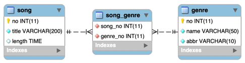
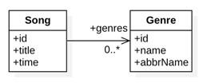

## 1. Mapping

#### 1. Domain

1. 테이블 연관관계 VS 객체 연관관계

   

   

2. 엔티티 연관관계 매핑의 3가지 기준
    1) 방향성(Direction): 객체지향의 Association에 가까운 개념
    2) 다중성(Multiplicity): 데이터베이스 Relation에 가까운 개념
    3) 연관관계의 주인(Owner of Associations)

3. 서비스(비즈니스, 도메인)에서 방향성을 결정한다.
    1) 음반 검색에서 노래와 쟝르의 관계이다.
    2) 노래 정보를 보여줄 때, 그 노래의 쟝르가 필요한 경우다.
    3) 쟝르 검색을 통해 해당 노래를 찾는 것도 필요하지만 이는 다대다 양방향에서 다룬다.
    4) 여기에서는 Song -> Genre로 참조가 이루어 지는 단방향을 매핑한다.

4. 다중성은 방향성이 결정나면 쉽게 결정 할 수 있다.
    1) Song은 다수의 쟝르에 포함될 수 있다. 쟝르도 해당 쟝르의 노래들이 많다.
    2) ManyToMany: Song(*) -> Genre(*)

5. 다대다 연관관계에서 관계형 데이터베이스와 JPA의 차이점
    1) 관계형 데이터베이스는 정규화된 테이블 2개로 다대다 관계를 표현할 수 없다.
    2) 그래서 다대다 관계를 일대다, 다대일 관계로 풀어내는 연결(조인)테이블을 사용한다.
    3) 객체는 테이블과 다르게 객체 2개로 다대다 관계를 만들 수 있다.
    4) Song 객체는 컬렉션을 사용해서 Genre들을 참조하면 되고 반대로 Genre들도 컬렉션을 사용해서 Song들을 참조하면 된다.
    5) 데이터베이스에서는 연결(조인)테이블을 두고 일대다, 다대일 관계로 풀어낸다.

#### 2. Entity Class: Song, User

1. ex09.domain.Song

   ```
   
   ...(생략)
   
   @ManyToMany(fetch = FetchType.LAZY)
   @JoinTable(name = "song_genre", joinColumns = @JoinColumn(name = "song_no"), inverseJoinColumns = @JoinColumn(name = "genre_no"))
   private List<Genre> genres = new ArrayList<Genre>();

   ...(생략)
   
   ```

    1) @ManyToMany 와 @JoinTable 을 사용해서 연결(조인)테이블을 바로 매핑한다.
    2) 노래와 쟝르를 연결하는 노래_쟝르(Song_Genre)엔티티 없이 매핑을 완료할 수 있다.
    3) @ManyToMany 기본 페치 전략은 LAZY 이다.
    4) @JoinTable.name : 연결(조인)테이블을 지정한다.
    5) @JoinTable.joinColumns : 현재 방향인 노래와 매핑할 조인 컬럼 정보를 지정한다. song_no로 지정
    6) @JoinTable.inverseJoinColumns : 반대 방향인 쟝릐와 매핑할 조인 컬럼 정보를 지정한다. genre_no로 지정했다.
    7) @ManyToMany 매핑으로 다대다 관계를 다룰 때는 연결(조인)테이블을 신경쓰지 않아도 된다.

2. ex09.domain.Genre
    1) 엔티티 매핑만 하면 된다.
    2) 당연히, 단방향에서는 관계의 주인이 아닌 엔티티는 연관관계 매핑을 하지 않는다. (연관관계 매핑필드 자체가 존재하지 않음)

#### 3. Tech. Focus

1. ManyToMany 단방향(Unidirectional)의 Collection Fetch QueryDSL 구현
2. ManyToMany 연결(조인)테이블의 문제점 이해와 해결방법
3. Native SQL 사용법
 
 


