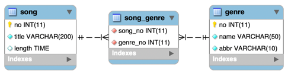

## 1. Mapping

#### 1. Domain

1. 테이블 연관관계 VS 객체 연관관계

   

   

2. 엔티티 연관관계 매핑의 3가지 기준
    1) 방향성(Direction): 객체지향의 Association에 가까운 개념
    2) 다중성(Multiplicity): 데이터베이스 Relation에 가까운 개념
    3) 연관관계의 주인(Owner of Associations)

3. 서비스(비즈니스, 도메인)에서 방향성을 결정한다.
    1) 음반검색에서 노래와 쟝르의 관계이다.
    2) 노래 정보를 보여줄 때 그 노래의 쟝르가 필요한 경우다.
    3) 쟝르 검색을 통해 해당 노래를 찾는 등의 기능이 필요한 경우다.
    4) Song <-> Genre로 양쪽에서 모두 참조가 이루어 지는 양방향(Biidirection)을 매핑한다.

4. 다중성은 방향성이 결정나면 쉽게 결정 할 수 있다.
    1) Song은 다수의 쟝르에 포함될 수 있다. 쟝르도 해당 쟝르의 노래들이 많다.
    2) ManyToMany: Song(*) <-> Genre(*)

5. 다대다 연관관계에서 관계형 데이터베이스와 JPA의 차이점
    1) 관계형 데이터베이스는 정규화된 테이블 2개로 다대다 관계를 표현할 수 없다.
    2) 그래서 다대다 관계를 일대다, 다대일 관계로 풀어내는 연결(조인)테이블을 사용한다.
    3) 객체는 테이블과 다르게 객체 2개로 다대다 관계를 만들 수 있다.
    4) Song 객체는 컬렉션을 사용해서 Genre들을 참조하면 되고 반대로 Genre들도 컬렉션을 사용해서 Song들을 참조하면 된다.
    5) 데이터베이스에서는 연결(조인)테이블을 두고 일대다, 다대일 관계로 풀어낸다.

#### 2. Entity Class: Song, User

1. ex11.domain.Song

   ```
   
   ...(생략)
   
   @ManyToMany(fetch = FetchType.LAZY)
   @JoinTable(name = "song_genre", joinColumns = @JoinColumn(name = "song_no"), inverseJoinColumns = @JoinColumn(name = "genre_no"))
   private Set<Genre> genres = new HashSet<Genre>();

   ...(생략)
   
   ```

    1) @ManyToMany 와 @JoinTable 을 사용해서 연결(조인)테이블을 바로 매핑한다.
    2) @ManyToMany 기본 페치 전략은 LAZY 이다.
    3) @JoinTable.name : 연결(조인)테이블을 지정한다.
    4) @JoinTable.joinColumns : 현재 방향인 노래와 매핑할 조인 컬럼 정보를 지정한다. song_no로 지정
    5) @JoinTable.inverseJoinColumns : 반대 방향인 쟝릐와 매핑할 조인 컬럼 정보를 지정한다. genre_no로 지정했다.
    6) @ManyToMany 매핑으로 다대다 관계를 다룰 때는 연결(조인)테이블을 신경쓰지 않아도 된다.
    7) Set를 사용하여 컬렉션 연관 필드를 정의했다.

2. ex11.domain.Genre

   ```
   
   ...(생략)
   
   @ManyToMany(mappedBy = "genres")
   private List<Song> songs = new ArrayList<Song>();

   ...(생략)
   
   ```

    1) ManyToMany 양방향에서는 관계주인이 아닌 엔티티는 mappedBy를 통해 관계의 주인이 아님을 선언한다.
    2) Song 엔티티가 관계의 주인이다.
    3) 마찬가지로 Set 타입으로 컬렉션 역관관계 필드를 설정했다.

3. ex11.domain.Song 엔티티의 편의 메소드 추가

   ```
   public void addGenres(Genre genre){
      genres.add(genre);
      genre.getSongs().add(this);
   }
      
   public void removeGenre(Genre genre){
      genres.remove(genre);
      genre.getSongs().remove(this);
   }
   
   ```

    1) 엔티티 양쪽에 연관필드가 있기 때문에 두 곳에 설정을 해주어야 한다.
    2) Song에 Genre를 추가할 때 Genre의 Song Collection에 자신을 추가해 준다.
    3) 반대로, Song에 Genre를 삭제할 때 Genre의 Song Collection에 자신을 삭제한다.

4. ex11.domain.Genre 엔티티 클래스에 편의 메소드 추가

   ```
   public void addSong(Song song) {
      songs.add(song);
      song.getGenres().add(this);
   }
       
   public void removeSong(Song song){
      song.getGenres().remove(this);
      songs.remove(this);
   }
      
   ```

    1) 엔티티 양쪽에 연관필드가 있기 때문에 두 곳에 설정을 해주어야 한다.
    2) Genre에 Song을 추가할 때 Song의 Genre Collection에 자신을 추가해 준다.
    3) 반대로, Genre에 Song을 삭제할 때 Song의 Genre Collection에서 자신을 삭제한다.

#### 3. Tech. Focus

1. ManyToMany 컬렉션 연관 필드의 타입은 Set를 사용해야 하는 이유 이해하기
 


