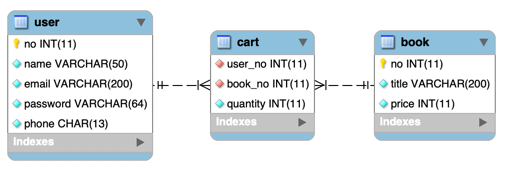
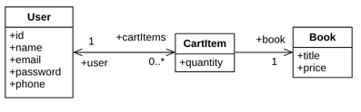

## 1. Mapping

#### 1. Domain

1. 테이블 연관관계 VS 객체 연관관계

   

   

2. 엔티티 연관관계 매핑의 3가지 기준
    1) 방향성(Direction): 객체지향의 Association에 가까운 개념
    2) 다중성(Multiplicity): 데이터베이스 Relation에 가까운 개념
    3) 연관관계의 주인(Owner of Associations)

3. 서비스(비즈니스, 도메인)에서 방향성을 결정한다.
    1) 온라인북몰에서 회원과 책과의 관계이다.
    2) 회원은 온라인북몰에서 관심있는 책을 저장(장바구니)할 수 있는 데 이는 User와 Book 사이에 ManyToMany로 생각할 수 있다.
    3) 앞의 09) 10) ManyToMany 연관관계 매핑은 몇 가지 문제점이 있다.
        - 외래키 두 개 이외에도 amount(수량)과 같은 새로운 칼럼이 더 필요한 경우가 있다.
        - 연결(조인)테이블을 사용해서 편하게 매핑이 가능한 장점이 있었지만 단점을 Native SQL 또는 Collection Type 변경 등으로 해결했다.
    4) 보통, 실무에서는 09, 10 ManyToMany 연관관계 매핑을 사용하지 않는다. 연결 엔티티를 정의하여 세 개의 엔티티로 매핑하는 복합모델을 사용하게 된다.
    5) 이 경우에는 User <-> CartItem (양방향) 과 CartItem -> Book (단방향)의 복합모델로 ManyToMany 연관관계 매핑을 한다.

4. 다중성은 방향성이 결정나면 쉽게 결정 할 수 있다.
    1) User는 다수의 책을 저장할 수 있기 때문에 User(1) <-> CartItem(*) 관계다.
    2) OneToMany 이지만 ManyToOne을 많이 선호하기 때문에 CartItem(*) <-> User(1) ManyToOne 양방향으로 결정한다.
    3) Book 엔티티와의 관계에서도 다수의 User가 Book 한 권을 장바구니에 담을 수 있기 때문에 CartItem(*) -> Book(1) 관계다.
    4) Book에서 User쪽을 탐색하는 드문 경우이기 때문에 CartItem -> Book ManyToOne 단방향으로 결정한다.

5. 다대다 연관관계에서 관계형 데이터베이스와 JPA의 차이점
    1) CartItem은 User, Book 엔티티와 각각의 관계에 두 개의 연관필드를 가지게 된다.
    2) 그리고 이 관계 모두에서 N 다중성을 가지고 있기 때문에 외래키 두 개를 가지게 된다.
    3) 새로운 Id(PK)를 만들 수 있지만, 이 외래키 2개을 하나로 묶어 PK로 사용하는 복합키 식별관계로 매핑한다.
    4) JPA에서는 복합키를 @EmebeddedId 또는 @IdClass로 지정할 수 있다.
    5) 여기서는 @EmebeddedId 방식으로 매핑하고 테스트 한다.

#### 2. Identifier Class(Id Class, 식별자 클래스): CartItemId

1. 복합키를 지원하기 위해 식별자 클래스를 따로 작성해주어야 한다: CartItemId
2. 엔티티(CartItem) 클래스에서는 식별자 클래스 타입(CartItemId)의 Id필드를 둔다.
3. ex11.domain.identifier.CartItemId

   ```
   @Embeddable
   public class CartItemId implements Serializable {
      
     private Integer userId;
     private Integer bookId;
       
     @Override
     public boolean equals(Object o) {
     
       ..(생략)
   
     }
            
     @Override
     public int hashCode() {

       ..(생략)
       
     }
   }                
       
   ```

    1) 식별자 클래스는 @Embeddabler을 적용한다.
    2) 식별자 클래스는 인터페이스 Serializable를 구현해야 한다.
    3) 컬럼 매핑은 식별자 클래스를 사용하는 연결엔티티(CartItem)에서 하지만 연결엔티티의 필드와 매핑할 수 있는 필드가 있어야 한다.(userId, bookId)
    4) 기본 생성자로 생성이 가능해야 한다.
    5) equals와 hashCode를 반드시 오버라이딩 한다.

#### 3. Entity Class: User, CartItem, Book

1. ex11.domain.CartItem

   ```
   
   @EmbeddedId
   public CartItemId catrtItemId = new CartItemId();
            
   @MapsId("bookId")
   @ManyToOne
   @JoinColumn(name="book_no")
   private Book book;
            
   @MapsId("userId")
   @ManyToOne
   @JoinColumn(name="user_no")
   private User user;
   
   ```
    1) @EmbeddedId를 사용하여 Id(PK) 필드를 지정한다. 필드명은 제약은 없지만 반드시 객체 생성을 해야 한다.
    2) CartItem 엔티티는 User 엔티티, Book 엔티티와 ManyToOne 관계를 맺기 때문에 관계주인 필드를 가진다.
    3) book, user가 관계주인 필드이다. 따라서 @JoinColumn를 지정하였으며 @ManyToOne으로 다중성도 지정했다.
    4) @MapsId를 지정하여 실제 컬럼값이 저장되는 객체의 필드와 매핑해야 한다. 코드상으로는 @EmbeddedId가 달려 있는 catrtItemId의 userId, bookId가 된다.

2. ex11.domain.User

   ```
   @OneToMany(mappedBy = "user", fetch = FetchType.LAZY)
   private List<CartItem> cart = new ArrayList<>();
   
   ```

    1) OneToMany ManyToOne 양방향 반대편(OntToMany)에서는 관계주인이 아닌 엔티티는 mappedBy를 통해 관계의 주인이 아님을 선언한다.
    2) CartItem.user가 관계 주인 필드가 된다.
    3) toMany 참조를 위해 컬렉션 매핑을 한다.

3. ex11.domain.Book
    1) ManyToOne 단방향 반대편 엔티티기 때문에 연관관계 매핑은 없다.

#### 3. Tech. Focus

1. ManyToMany 조인테이블 보다 실무에서는 연결엔티티를 사용한 혼합모델을 더 선호하고 사용해야 한다.
2. 연결엔티티(CartItem)의 CRUD 작성
3. 혼합모델에서 QueryDsl과 기본 메소드 및 쿼리 메소드와의 성능 비교
 


