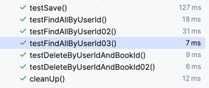

## 2. ex11.repository.CartItemRepository: based on QueryDSL with Spring Data JPA

#### Notes
1. JpaRepositry
   1) ManyToMany 조인테이블 대신 연결엔티티로 매핑하였기 때문에 편리한 두 엔티티(User, Book)간의 관계에 쿼리메소드를 사용할 수 있다. 
   2) findAllByUserId(userId): userId로 장바구니 리스트를 가져올 수 있다. 
   3) deleteByUserIdAndBookId(userId, bookId): userId와 bookId로 장바구니에서 삭제를 한다.
   4) JpaRepositry의 자동생성 쿼리 메소드 findAllByUserId와 deleteByUserIdAndBookId의 테스트의 쿼리로그를 보면 성능에 문제가 있기 때문에 QueryDSL기반 메소드를 만드는 것이 보통이다.

2. QuerydslCartItemRepositry
    1) 성능에 문제가 있는 JpaRepositry 기반의 기본메소드와 쿼리메소드를  QueryDSL기반 메소드로 대체 구현한다.
    2) findAllByUserId02(userId)
    3) findAllByUserId03(userid)
    4) deleteByUserIdAndBookId02(userId, bookId)

#### 테스트 01: testSave

1. 테스트를 위한 User, Book, CartItem 데이터를 저장한다.
2. ManyToMant 조인테이블 대신 연결엔티티(CartItem)을 사용하기 때문에 CartItemRepository를 통해 쉽게 관계를 설정할 수 있다.

#### 테스트 02: testFindAllByUserId

1. userId로 CartItem 리스트를 가져온다.
2. 두 가지 방식으로 가져 올 수 있다.
   1) User 객체 그래프 탐색 지연로딩을 사용해 가져오기(TestUserRepository.testFindById 참고)
      - UserRepositoryTest.testFindById
      
        ```
            User user = userRepository.findById(1L).get();
            List<CartItem> cart = user.getCart();
        
        ```

      - 쿼리 로그를 확인해 보면 조인이 실행되어 CartItem 콜렉션을 별문제 없이 받아 올수 있다.
      - 문제는 CartItem 콜렉션(cart) 내용이다.

        ```
        CartItem{user=User{no=1, name='둘리', email='dooly@gmail.com', password='1234'}, book=Book{no=1, title='책1', price=1000}, amount=1}
        CartItem{user=User{no=1, name='둘리', email='dooly@gmail.com', password='1234'}, book=Book{no=2, title='책2', price=1000}, amount=2}
                        
        ```
        크게 문제 될 것은 없지만 장바구니 내용을 구성하기에 필요없는 User 내용이 전부 있는 것이 불만이다.
   
   2) CartItemRepository 기본 쿼리 메소드인 findAllByUserId(userId)를 사용해서 User의 번호를 파라미터로 전달하여 가져오기
      - 쿼리 로그를 보면 최악이다. 일단 CartItem을 가져오기 위해 User와 조인을 한 쿼리가 실행된다.
      - CartItem 내용(엔티티 객체)을 채우기 위해 개별적 User, Book 쿼리가 실행된다.
3. 결론은 사용자의 번호로 장바구니(cart)안의 항목(CartItem) 리스트를 가져오기 위해 QueryDSL을 사용하지 않고 기본메소드, 쿼리메소드만 사용할 생각이면 User 엔티티 객체를 통한 그래프 탐색이 좋다.

#### 테스트 03: testFindAllByUserId02

1. 사용자의 번호로 장바구니(cart)안의 항목(CartItem) 리스트를 가져오기 위해 QueryDSL로 작성한 QuerydslCartItemRepository.findAllByUserId02(userId) 테스트이다.
2. 쿼리 로그를 보면 CartItem, User, Book 세 테이블에 조인 쿼리가 실행되었음을 알 수가 있다.
3. 주의할 것은 조인쿼리가 개별적으로 나눠서 실행하는 select쿼리 보다 성능이 반드시 좋다고 볼 수는 없다.
4. 성능(시간)에 큰 영향을 주는 것은 오히려 projection일 수 있다.

#### 테스트 04: testFindAllByUserId03

1. 세 테이블에 대한 조인과 프로젝션을 적용한 QuerydslCartItemRepository.findAllByUserId03(userId)의 테스트이다.
2. 성능 비교

   

3. testFindAllByUserId, testFindAllByUserId02, testFindAllByUserId03 테스트의 실행 시간을 보면, 프로젝션과 조인을 함께 실행한 test04FindAllByUserNo3이 확연히 빠름을 알 수 있다.

#### 테스트 04: testDeleteByUserIdAndBookId

1. 쿼리메소드 JpaCartItemRepository.deleteByUserIdAndBookId(userId, bookId)의 테스트이다.
2. 09, 10의 ManyToMany 연결(조인)테이블을 사용하는 것과 달리, 연결엔티티의 레포지토리의 쿼리메소드로 편리하게 삭제를 할 수 있다.
3. 하지만, 퀄리 로그를 확인해보면 생각보다 많은 쿼리가 실행됨을 알 수 있다.
4. 쿼리 자체로 보면 큰 부담이 없고 삭제 대상은 아니지만 연관된 두 엔티티 객체를 영속화 하는 것이 필요한 경우에는 고려해 볼 만 하다. 이 경우가 아니라면 바로 삭제 쿼리가 실행되는 것이 좋다.


#### 테스트 05: testDeleteByUserIdAndBookId02
1. QueryDSL를 사용해서 바로 삭제 쿼리가 실행될 수 있도록 작성한 QuerydslCartItemRepository.deleteByUserIdAndBookId02 메소드 테스트이다.
2. 성능(시간) 비교

   

3. 시간상 큰 차이는 없지만, 캐쉬, 메모리 등을 비교해 보면 더 차이가 있을 수 있으며 많은 수의 삭제는 문제가 발생할 가능성이 있다.
4. 연관된 엔티티의 영속화가 필요없거나 또는 드문드문 적은 수로 삭제를 하는 경우를 제외하고 QueryDSL를 사용해 삭제 쿼리만 실행하는 것이 좋다.


